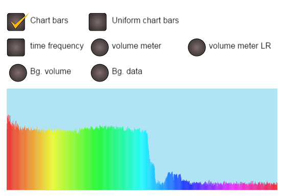

# phaser-sound-analyse
SoundAnalyse plugin is intended to be used with [Phaser.js](https://github.com/photonstorm/phaser) game engine.

Phaser SoundAnalyse plugin - provide you with possibility to create real time visual frequency/time data analyser, simple sound analyse object with real time data update callback, audio analyse object, bitmap sound analyse object.

[Demo link](http://zarkokaktus.byethost3.com/Phaser/sound_analyser/index.php)

Image preview



Table of contents
=================

  * [Installation](#installation)
  * [Create plugin instance](#create-plugin-instance)
  * [Create SoundAnalyse sprite object](#create-soundanalyse-sprite-object)
  * [Complete example](#complete-example)
  * [About objects in this plugin](#about-objects-in-this-plugin)

Installation
=================

* Clone this [repository](https://github.com/KaktusFlame/phaser-sound-analyser.git)
* Or download javaScript plugin [SoundAnalyse.js](js/plugin/SoundAnalyse/SoundAnalyse.js)
* Copy/Move "SoundAnalyse.js" file to your project path

Then you need to include plugin script file into your project (after phaser library):

```html
<script src="[path_to_phaser]/phaser.js"></script>
<!-- SoundAnalyse plugin -->
<script src="[path_to_plugin]/SoundAnalyse.js"></script>
```
or with Phaser loader in preload method:
```javascript
function preload () {
	// ......
	game.load.script('soundAnalysePlugin', '[path_to_plugin]/SoundAnalyse.js');
    //.......
}
```

Don't forget to load sound :)
```javascript
function preload () {
	// ......
	game.load.audio('song1', '[path_to_sond]/some_sound.mp3', true);
    // ......
}
```

Create plugin instance
=================

In phaser Create method, or if you are using Phaser with game states - then in your create method of the main game state, add the following code:
```javascript
function create () {
	// ......
	var soundAnalyse = game.plugins.add(new Phaser.Plugin.SoundAnalyse(game));
    // ......
}
```
You can now use "add" object from created plugin instance to access different methods that allow you to create new sound analyse objects. The methods provided are:
- soundAnalyse.add.**soundAnalyse**
- soundAnalyse.add.**bitmapDataSoundAnalyse**
- soundAnalyse.add.**soundAnalyseSprite** - *most used*
- soundAnalyse.add.**audioAnalyseSprite**

*Hint: they are decribed at the end of this readme*

Create SoundAnalyse sprite object
=================
In phaser Create method, or if you are using Phaser with game states - then in your create method of the main game state, add the following code:
```javascript
function create () {
    // ......
	var soundAnalyseSprite = soundAnalyse.add.soundAnalyseSprite(
    	20/*x*/, 200/*y*/, 530/*width*/, 200/*height*/, "song1"/*sound key*/, true/*auto play*/, this._onDecodeFinish/*decode finish callback*/, this/*callback context*/);
        
    // show frequency domain chart bars
    soundAnalyseSprite.showFrequencyDomainChartBars(true);
    
    // DONE!!! :)
}
```

Complete example
========
All paths in this example are related to the data strcture in this plugin repository
```javascript
<!doctype html>

<html lang="en">
<head>
  <meta charset="utf-8">
  <title>Phaser - Sound Analyse</title>
  <meta name="description" content="Example use of Phaser SoundAnalyse plugin">
  <meta name="author" content="SoundAnalyse">
  
  <!-- Phaser.js library -->
  <script src="js/lib/phaser.js"></script>
</head>

<body>

  <script>
  	// create new Phaser game
    var game = new Phaser.Game(800, 600, Phaser.AUTO, 'phaser-example', { preload: preload, create: create });

	// function called on game asset preload
    function preload() {
    
    	// load SoundAnalyse plugin script file
        game.load.script('soundAnalysePlugin', 'js/plugin/SoundAnalyse/SoundAnalyse.js');
        
        // load song file
        game.load.audio('song1', 'audio/All_Time_Low__Time_Bomb.mp3', true);
        
    }

	// function called after all assets are loaded
    function create() {

        // create plugin instance
        var soundAnalyse = game.plugins.add(new Phaser.Plugin.SoundAnalyse(game));
        
        // create new Sprite sound analyse object
        var soundAnalyseSprite = soundAnalyse.add.soundAnalyseSprite(
    	20/*x*/, 200/*y*/, 530/*width*/, 200/*height*/, "song1"/*sound key*/, true/*auto play*/, this._onDecodeFinish/*decode finish callback*/, this/*callback context*/);
        
        // show frequency domain chart bars
        soundAnalyseSprite.showFrequencyDomainChartBars(true);

    }
  </script>
  
</body>
</html>
```


About objects in this plugin
=================

You can create and combine the following object types:

**Phaser.SoundAnalyser**
- Extension object from Phaser.Sound, with posibiblity to analyse audio data.
- All other objects use this base object so they can recive data update.
- This object store Phaser.BitmapDataSoundAnalyze objects in array so it can call their sound analyse data update methods on every game thick (only if sound is in play state)
- You can add update event listener

**Phaser.BitmapDataSoundAnalyze**
- Extension object from Phaser.BitmapData 
- It will represent plugin sound analyse drawing surface (sprite texture). 
- It have many drawing options that you can enable/disable in real time
- You can define different colors for different options
- You can use this object as a Sprite texture directly (but don't forget you will need to add this object to Phaser.SoundAnalyser instance) or use Phaser.SoundAnalyseSprite

**Phaser.SoundAnalyseSprite**
- Extension object from Phaser.Sprite
- It represent: sprite with sound analyse drawing surface and sound object it self
- Direct exposure to sound events: onPlay, onPause, onStop, onResume, onMute, onLoop, onFadeComplete
- Direct exposure to sound methods: play, pause, stop, resume, restart, fadeIn, fadeOut, fadeTo, loopFull, addMarker, removeMarker
- Methods to get sond state
- Methods to set drawing flags

*Hint: always set new with or heigh by using provided method: resize(w, h)*

**Phaser.AudioAnalyseSprite**
- Extension object from Phaser.AudioAnalyseSprite
- Same functionality as the orginal object but it will create Phaser.SoundAnalyser objects insteat of Phaser.Sound objects


